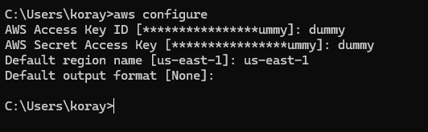
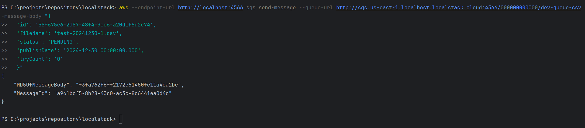

# localstack
This project is built for creating an emulator for simulating AWS environment for my personal project.
You can find related scripts to run on local to create AWS services like S3,  SQS, etc.

Before start, you need to configure your aws config with given below method.

## Bucket Scripts
* aws --endpoint-url http://localhost:4566 s3 mb s3://parlar --region us-east-1
* aws --endpoint-url http://localhost:4566 s3 cp c:\...\documents\localstack s3://parlar --recursive

## Directory Creation
* aws --endpoint-url http://localhost:4566 s3 cp c:\...\documents\localstack\upload s3://parlar --recursive

## List Directories
* aws --endpoint-url http://localhost:4566 s3 ls s3:///parlar --recursive

## Removes everything except jpgs
* aws --endpoint-url http://localhost:4566 s3 rm s3:///parlar --recursive --exclude "*.jpg"

## Create a queue
* aws --endpoint-url http://localhost:4566 sqs create-queue --queue-name dev-queue-csv

## List Queues
* aws --endpoint-url http://localhost:4566 sqs list-queues

## Send message to queue
* aws --endpoint-url http://localhost:4566 sqs send-message --queue-url http://sqs.us-east-1.localhost.localstack.cloud:4566/000000000000/dev-queue-csv --message-body "{
  'id': '55f675e6-2d57-48f4-9ee6-a20d1f6d2e74',
  'fileName': 'test-20241230-1.csv',
  'status': 'PENDING',
  'publishDate': '2024-12-30 00:00:00.000',
  'tryCount': '0'
  }"

it will return messagebody and messageIds.

## Receive message from queue

* aws --endpoint-url http://localhost:4566 sqs receive-message --queue-url http://sqs.us-east-1.localhost.localstack.cloud:4566/000000000000/dev-queue-csv

## Purge messages from queue
* aws --endpoint-url http://localhost:4566 sqs purge-queue --queue-url http://sqs.us-east-1.localhost.localstack.cloud:4566/000000000000/dev-queue-csv

